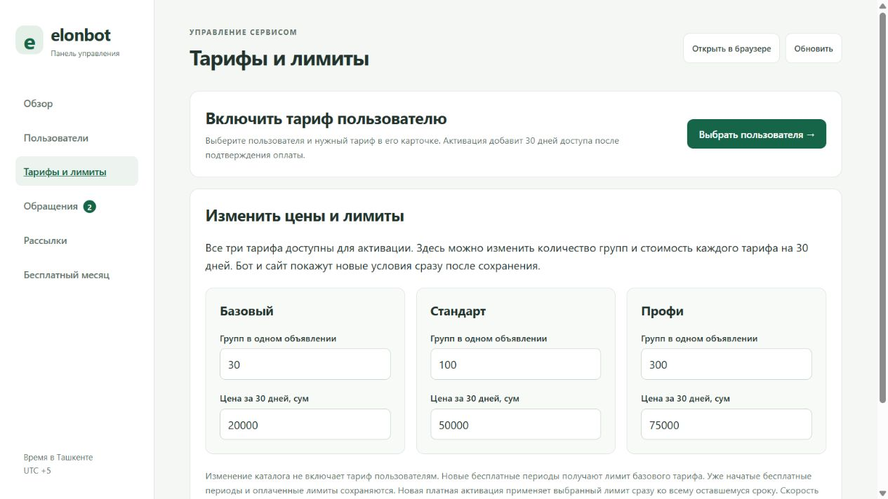
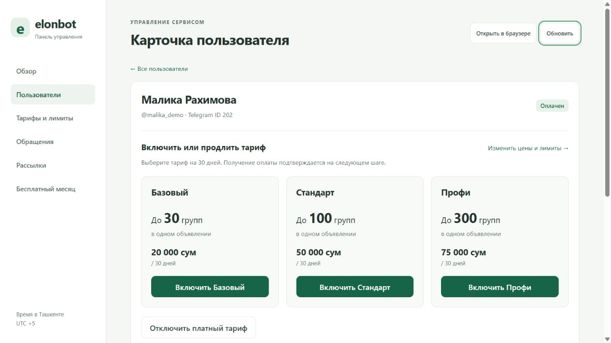

# Где включать тарифы и менять количество групп

Откройте `/admin` в боте и нажмите кнопку входа в админку. Доступ нужен из аккаунта администратора, указанного в `ADMIN_IDS`.

## Изменить цены и лимиты тарифов

На главной нажмите **Цены и лимиты** или выберите **Тарифы и лимиты** в меню. В трёх карточках можно менять число групп в одном объявлении и цену за 30 дней:

| Тариф | Начальный лимит | Начальная цена |
| --- | ---: | ---: |
| Базовый | 30 групп | 20 000 сум |
| Стандарт | 100 групп | 50 000 сум |
| Профи | 300 групп | 75 000 сум |

Нажмите **Сохранить тарифы**. Значения появляются в боте, на сайте и в карточках активации без перезапуска. Все три тарифа уже доступны; отдельное глобальное включение тарифа не требуется.

## Включить тариф конкретному пользователю

**Пользователи → нужный пользователь → Включить или продлить тариф**. Выберите **Включить Стандарт** для текущего лимита стандартного тарифа или **Включить Профи** для профессионального. Перед активацией окно покажет сумму, лимит групп и новый срок. После получения оплаты нажмите **Подтвердить оплату и включить**.

Активация добавляет 30 дней к оставшемуся сроку и применяет выбранный лимит сразу. Данные об активации находятся на вкладке **История тарифов**. Изменение каталога само по себе не активирует подписку и не меняет уже оплаченный пользователем лимит. Действующий лимит виден в профиле в строке **Групп в одном объявлении**.

## Если раздела на сервере нет

В локальной версии раздел проверен. Отсутствие раздела в вашей запущенной версии можно проверить после обычного обновления сервера: сначала отправьте коммиты в репозиторий, затем запустите `sudo bash /home/deploy/update-elonbot.sh`. Закройте админку в Telegram и откройте её заново через `/admin`. Актуальное состояние рабочего сервера из этого окружения не проверялось.

## Проверка изменений

Все действия выполнялись в отдельной локальной тестовой базе, без реальных Telegram-отправок и платежей:

- Стандарт изменён с 100 / 50 000 на 120 / 60 000; после обновления и открытия карточки пользователя показаны сохранённые новые условия.
- Начальные условия 100 / 50 000 восстановлены.
- Через интерфейс активированы 100 групп одному тестовому пользователю и 300 другому; профили показывают соответствующие тарифы и лимиты.
- Прошли 10 существующих проверок тарифов и админки, а также проверка синтаксиса `admin.js`.
- Проверена ширина 390 px: горизонтального переполнения страницы нет, все три кнопки активации доступны; на настольном экране карточки стоят рядом.
