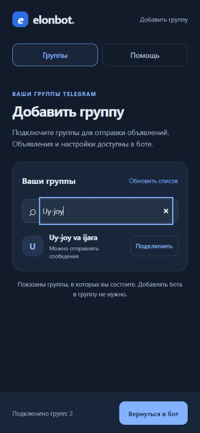
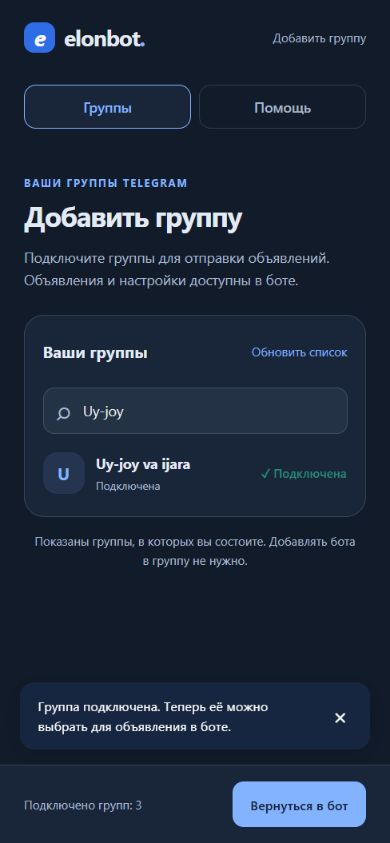

# Бизнес-логика Elonbot: аудит 20 сентября 2026

**Обновление после аудита:** по запросу владельца суточный лимит 500 отменён. Ниже сохранён исходный анализ коммита `94482aa`; сведения о действии суточной квоты в нём исторические. Рекомендации 1–6 реализованы: безопасное отключение групп, пауза и статусы, проверка готового текста, независимый учёт скорости, уведомления о тарифе и результаты отправки. Текущее поведение описано в README и проверяется в `app/tests/delivery-controls.test.ts`, `app/tests/notifications.test.ts` и `app/tests/delivery.test.ts`. Проверочный сценарий этой папки предназначен для исходного коммита до отмены лимита.

Elonbot решает понятную задачу: человек один раз готовит объявление, выбирает свои Telegram-группы и расписание, затем сервис публикует его от имени этого человека. Следующий приоритет — сделать отправку предсказуемой и управляемой. Сейчас ограничения, состояние доставки и некоторые последствия удаления недостаточно видны пользователю. Это мешает обещанию «один раз настройте — бот отправляет сам».

Это вывод об устройстве продукта, а не доказательство спроса или прибыльности. Для оценки рынка, конверсии и окупаемости нужны реальные данные, которых в этом исследовании нет.

## Основания и границы

- Проверен текущий TypeScript-код на коммите `94482aa`, документация и четыре сценария на изолированной PGlite с подставным Telegram. Результаты — [verification.json](verification.json), воспроизводимый сценарий — [verify.ts](verify.ts).
- Просмотрен действующий интерфейс добавления групп через предусмотренную проектом демонстрацию, на ширине 390 px. Три принятых скриншота ниже сделаны в этом аудите.
- Рабочая база, реальные аккаунты, платежи и серверные переменные окружения не проверялись. Числовые лимиты ниже — значения по умолчанию из кода, на сервере их можно переопределить.
- Настоящий чат Telegram, авторизация реального аккаунта, экранная клавиатура телефона, VoiceOver/TalkBack и производительность под нагрузкой не проверялись. Воспроизведение бизнес-ошибок не заменяет эти проверки.
- Использованы The Business Engineer · Gennaro Cuofano и Product Design. Business Strategy Builder найден; его отдельный интерактивный конструктор не запускался, поскольку задача — анализ существующей логики.

## Модель продукта и действующие правила

Предполагаемый покупатель — человек, который регулярно размещает похожие объявления в нескольких группах: например, продавец услуг, товаров или недвижимости. Это рабочая гипотеза о сегменте, а не установленный портрет клиентов. Польза — экономия повторяющегося труда и соблюдение выбранного расписания. Отправка сообщения сама по себе не доказывает получение обращения или продажу.

| Правило | Что реализовано |
|---|---|
| Первый контакт | Узбекский язык, предложение оставить его или выбрать русский; выбор сохраняется |
| Отправитель | Подключённый Telegram-аккаунт самого пользователя |
| Подключённые группы | Без общего лимита; нужны членство и право отправки |
| Получатели объявления | До 30 групп на одно объявление |
| Активные объявления | До 10 на пользователя |
| Фотографии | До 10; новые объявления и шаблоны хранят ID исходных сообщений, старые file_id поддерживаются |
| Интервалы | 5, 10, 15, 20, 60, 120, 180, 300 или 480 минут |
| Часы работы | Окно по времени Ташкента, в том числе через полночь |
| Ограничение потока | До 20 учитываемых доставок в минуту на аккаунт, 1 в минуту в одну группу, 500 за последние 24 часа |
| Бесплатный период | 7 дней с подтверждённого создания первого объявления, не с первого `/start` |
| Оплата | 20 000 сум за 30 дней, активация администратором; продление добавляется к наиболее поздней дате из текущего времени, конца trial и оплаты |
| Истечение доступа | Отправки перестают выбираться планировщиком; объявления остаются. После продления активные объявления снова допускаются к отправке |

Источники: [config.ts](../../app/config.ts), [billing.ts](../../app/billing.ts), [bot.ts](../../app/bot.ts), [delivery.ts](../../app/delivery.ts), [admin.ts](../../app/admin.ts).

Единица квоты — запись доставки объявления в группу с `sent_at`, включая некоторые частичные результаты. Это не обязательно одно Telegram-сообщение: альбом и длинный текст могут дать несколько сообщений. Названия внутренних параметров и пользовательские условия стоит привести к одной единице.

Сильные стороны уже есть: trial не расходуется при регистрации; подключение групп отделено от выбора получателей конкретного объявления; сервер повторно проверяет доступ; платежные активации защищены от повторного запроса; ключи отправки стабильны при повторах; учтены временные ограничения Telegram, истечение подписки во время отправки и пропажа исходного фото. Это полезная основа, которую стоит сохранить.

## Подтверждённые проблемы и приоритеты

P1 означает исправление до активного привлечения платящих пользователей; P2 — следующую итерацию после устранения P1. Приоритеты качественные, без придуманной числовой оценки ущерба.

### 1. P1 — отключение последней группы удаляет больше, чем обещает подтверждение

Пользователь видит: «Удалить группу из вашего списка? Она также будет исключена из ваших объявлений». Если это последняя группа объявления, обработчик вызывает удаление прежних публикаций и удаляет само объявление. При нескольких группах поведение другое: удаляется только связь с группой.

**Воспроизведено:** после подтверждения отключения последней группы исчезло объявление, а подставной транспорт получил удаление сообщения `4001`. Это не визуальная гипотеза. Источники: [bot.ts](../../app/bot.ts) — обработчик `groups:delete_confirm`, [ru.json](../../app/ru.json) — `groups.disconnect_confirm`.

**Решение:** отключение группы должно убирать получателя. Объявление без доступных получателей сохранять остановленным с объяснением. Удаление самого объявления и старых публикаций предлагать отдельными явными действиями, как уже сделано в обычном сценарии удаления объявления. Проверка готовности: после отключения последней группы публикации в Telegram и содержимое объявления сохраняются.

### 2. P1 — удаление объявления обнуляет его вклад в лимиты

Лимиты считаются по `delivery_logs`, а эти строки удаляются каскадно вместе с объявлением. Пользователь может отправить сообщения, удалить объявление с сохранением публикаций в Telegram, создать другое и получить новый запас отправок.

**Воспроизведено:** для компактной проверки установлен лимит 1. Первая доставка прошла, следующая была остановлена лимитом. После удаления первого объявления счётчик стал 0, и вторая доставка прошла в те же сутки. Механизм тот же при значении 500. Источники: [delivery.ts](../../app/delivery.ts) — `rateLimit`, [001_typescript.sql](../../migrations/001_typescript.sql) — `delivery_logs ... ON DELETE CASCADE`, [bot.ts](../../app/bot.ts) — окончательное удаление объявления.

**Решение:** учитывать использование аккаунта независимо от жизненного цикла объявления. Сохранять минимальные факты расхода квоты на весь интервал ограничения; удаление содержания объявления не должно уменьшать расход. Этот же дефект искажает накопительную статистику доставок.

### 3. P1 — карточка не показывает, работает ли объявление, и не даёт поставить его на паузу

Карточка показывает текст, интервал, число групп и часы отправки. Кнопки — «Редактировать», «Удалить», «Назад». В ней нет статуса доставки, причины ожидания, последнего результата, следующей попытки или ручной паузы. Статусы `active` и `paused` есть в базе, но пользовательский путь управления ими неполон.

**Воспроизведено:** карточка объявления с истёкшим тарифом выглядит как обычная карточка с расписанием и теми же тремя кнопками. Раздел «Тариф» сообщает об истечении, однако пользователь должен сам туда зайти. Автоматические напоминания об окончании trial/подписки и уведомление об активации тарифа в текущих обработчиках не найдены. Источники: [bot.ts](../../app/bot.ts) — `showCard`, [main.ts](../../app/main.ts) — обслуживание, [admin.ts](../../app/admin.ts) — активация.

**Решение:** отдельная «Пауза / Возобновить», фактическое состояние («отправляется», «ждёт лимита», «тариф истёк», «нет доступных групп», «нужно заменить фото»), последний итог по группам и время следующей попытки. После продления объяснять, какие сохранённые объявления снова работают. Проверка готовности: человек понимает состояние и может остановить объявление, не удаляя его.

### 4. P1 — выбранное расписание может требовать существенно больше разрешённой квоты

Объявление в 30 групп каждые 20 минут с 07:00 до 22:00 требует приблизительно **30 × 15 × 3 = 1 350 доставок в день**, если выполнять заданный ритм. Общая квота — **500 за скользящие 24 часа**. Это расчёт желаемого объёма при равномерном расписании, не измерение фактической скорости: текущий планировщик добавляет интервал после завершения прохода, а ожидания удлиняют цикл.

При часе между повторами один такой сценарий требует около 450 доставок; несколько объявлений делят одну квоту и могут превысить её даже с часовым интервалом. Дополнительно лимит 20 в минуту не позволяет отправить текст сразу во все 30 групп за одну минуту. Достижение суточной квоты откладывает повторную проверку примерно на час, а не до точно рассчитанного освобождения слота.

Проверено по коду: интерфейс предлагает интервал, но предпросмотр не рассчитывает суммарную нагрузку всех объявлений и не показывает оставшуюся квоту. [config.ts](../../app/config.ts), [bot.ts](../../app/bot.ts) — `showConfirmation`, [delivery.ts](../../app/delivery.ts) — `process` и `rateLimit`.

**Решение:** перед запуском показывать ожидаемый объём, общий доступный остаток и вероятную задержку. Согласовать продуктовую семантику: точное расписание с проверкой допустимости либо отправка с минимальным интервалом и возможным ожиданием. Не повышать квоту просто ради совпадения с красивым обещанием.

### 5. P2 — допустимый текст превращается в слишком длинное сообщение после добавления контактов

Проверка содержимого ограничивает только основной текст 4 096 символами. При отправке к нему добавляются имя, телефон и Telegram-контакт, а транспорт проверяет уже полное сообщение.

**Воспроизведено:** объявление с основным текстом 4 096 символов и именем контакта принято, затем получило `MESSAGE_TOO_LONG`. Пользовательских уведомлений в этой ветке не было; ошибка сохраняется в журнале. Источники: [bot.ts](../../app/bot.ts) — `validateContent`, [delivery.ts](../../app/delivery.ts) — `renderText` и `sendOne`, [telegram.ts](../../app/telegram.ts) — `send`.

**Решение:** проверять итоговое сообщение при создании и изменении, используя ту же сборку и разбор текста, что при отправке. Для постоянных ошибок показывать понятную причину и останавливать бесполезные повторы до исправления содержания.

## Монетизация, ограничения роста и проверяемые гипотезы

Ручная оплата подходит для раннего продукта, пока подтверждения быстрые и обращений мало. В коде уже есть история активаций и защита от двойного продления. При росте ограничением может стать время администратора между обращением и включением тарифа. Это гипотеза: измерений ожидания сейчас нет. Следующий шаг — статусы запроса на оплату, подтверждение пользователю и измерение задержки; платёжную интеграцию выбирать после появления повторяемого объёма оплат.

Текущая цена не позволяет судить о прибыльности без расходов. Для ориентира, 100 фактически оплаченных периодов по 20 000 сум дают 2 000 000 сум поступлений, 500 — 10 000 000 сум. Это арифметика без скидок и возвратов, а не прогноз выручки. Нужно вычесть сервер, хранение и передачу фото, время поддержки, расходы приёма платежей и другие реальные издержки. «Сумма активаций» в админке корректно подписана как сумма ручных активаций, но сама по себе не подтверждает поступление денег.

Платформа — внешнее ограничение: Telegram прямо описывает санкции за спам через API и ограничения после жалоб на нежелательную рекламу. Поэтому 30 групп и 500 доставок — внутренние правила Elonbot, а не гарантированная Telegram безопасная квота. Позиционирование должно обещать автоматизацию допустимых публикаций в выбранных группах, где такие объявления разрешены. [Официальная документация Telegram API](https://core.telegram.org/api/obtaining_api_id), [Telegram Spam FAQ](https://telegram.org/faq_spam).

Продукт не является площадкой с собственной аудиторией: группы и доступ к ним принадлежат внешней платформе и сообществам. Больше зарегистрированных пользователей само по себе не доказывает сетевой эффект. Возможные причины остаться — надёжность расписаний, понятные статусы, сохранённые настройки, узбекский интерфейс и быстрая поддержка. Их влияние на продление нужно измерять.

Рабочая гипотеза: перед привлечением большего числа клиентов выгоднее улучшить получение первого проверенного результата и контроль последующих отправок. Контргипотеза: даже идеально работающая рассылка может не приводить к обращениям покупателей, и именно это будет причиной отказа от подписки. Различить их помогут интервью с продлившими и ушедшими клиентами вместе с историей успешных отправок. Не считать рост числа отправленных сообщений доказательством роста продаж.

## Путь пользователя и измерение результата

Текущий путь по коду: **язык → подключение своего аккаунта → подключение групп в Mini App → возврат в бот → текст/пересланный альбом → выбор групп → интервал → часы отправки → первый запуск → решение о шаблоне → подтверждение → первая доставка → продление**.

Самые вероятные места потерь — доверие при входе в аккаунт, переход между ботом и Mini App и количество решений до первой доставки. Это гипотезы, поскольку реальной воронки нет. Шаблон сокращает повторные действия; для новичка стоит проверить краткий путь с понятными настройками по умолчанию и расширенными параметрами по желанию. Сохранить явный выбор получателей и подтверждение запуска.

| Метрика | Как определять и зачем |
|---|---|
| Первая ценность | Доля новых пользователей с первой подтверждённой доставкой в выбранную ими группу; отдельно время от первого контакта и от подтверждения запуска |
| Потери до запуска | Конверсии в подключение аккаунта, подключение группы, подтверждение объявления и первую доставку; ошибки по каждому шагу |
| Надёжность | Для каждого запланированного прохода число ожидаемых получателей, успешных, ожидающих и постоянных ошибок; задержка относительно согласованной семантики расписания |
| Удержание | Пользователь продолжает получать нужные ему публикации на второй неделе; сопоставлять доставки с подтверждённой актуальностью объявления, а не только входами в бот |
| Trial → оплата | Подтверждённые оплаты среди пользователей, чей пробный период закончился; использовать одинаковое окно наблюдения |
| Продление | Доля оплативших следующий период среди тех, чей оплаченный период завершился; не смешивать с новыми клиентами |
| Цена обслуживания | Время поддержки и переменные расходы на одного платящего пользователя за период; отдельно задержка активации после оплаты |

Существующие журналы частично позволяют восстановить результат отправок, но не все промежуточные шаги. Удаление объявлений сейчас уничтожает и часть истории, поэтому сначала отделить учёт использования и аналитические события от содержимого. Для новых событий достаточно типа шага, времени, ID пользователя/объявления и кода результата; копировать текст объявлений, пароли или фото в аналитику не требуется.

## Ограниченный UX-аудит: добавление групп

1. **Список групп — работает, есть риск мелкого текста.** Подключённые и доступные группы различаются, поиск виден, кнопка возврата закреплена. Служебные подписи и «Обновить список» на телефоне мелкие: увеличить читаемость и проверить касания. Это визуальный риск, а не заключение о несоответствии WCAG.

2. **Поиск — работает.** Запрос `Uy-joy` оставил нужную группу; есть видимая рамка фокуса и понятное имя поля в дереве доступности. Реальная мобильная клавиатура и озвучивание результатов не проверялись.

3. **Подключение — работает, продолжение требует внимания.** Группа стала подключённой, счётчик изменился с 2 на 3, появилось сообщение о следующем действии. Оно объясняет, что группу ещё нужно выбрать для объявления в боте. Сделать эту инструкцию постоянной рядом с возвратом, чтобы она не зависела от временного уведомления. Фактическое закрытие Mini App в Telegram не проверялось: в демонстрации это заглушка.

Скриншоты подтверждают только этот ограниченный путь. Выводы о карточках объявлений выше получены из исполняемой логики и подставных ответов Bot API, а не из визуального аудита настоящего чата Telegram.

## Порядок следующей работы

1. Исправить последствия отключения последней группы и независимость квот от удаления. Владелец: разработка; критерии — описанные выше воспроизведения больше не показывают опасное поведение.
2. Добавить паузу, состояния и причины ожидания, проверку полного текста и расчёт нагрузки перед запуском. Владелец: разработка и владелец продукта; согласовать семантику интервала до реализации.
3. Сделать подтверждение активации и напоминания об окончании доступа с защитой от повторных уведомлений. Проверить удобство на реальном телефоне в обоих языках.
4. Включить минимальную воронку и оценку надёжности, затем проверить укороченный первый запуск на ограниченной группе пользователей, сохранив сравнимую контрольную группу при достаточном потоке. Основной результат — успешная первая публикация и последующее полезное использование, не число кликов.
5. После данных о продлениях и стоимости поддержки принимать решения о цене, автоматизации оплаты и расширении функций. Если доставки надёжны, а клиенты не получают полезного результата, пересмотреть сегмент и сценарий использования.

Методология: The Business Engineer · Gennaro Cuofano — `Constraint Mapping` (BE-00-015), `Time-to-Magic` (BE-08-051), `Retention Is the Ceiling` (BE-09-004), `Activation Is the First Verified Outcome` (BE-08-039), `The Counterfactual as Referee` (BE-09-036). Они использованы как способы постановки вопросов; не как доказательство рыночных выводов. Product Design использован для ограниченного аудита трёх экранов.

Основной код приложения не изменён. Отчёт, скриншоты и проверочный сценарий добавлены в эту папку. Для повторения проверки из корня проекта: `node --import tsx docs/business-audit-2026-09-20/verify.ts`.
