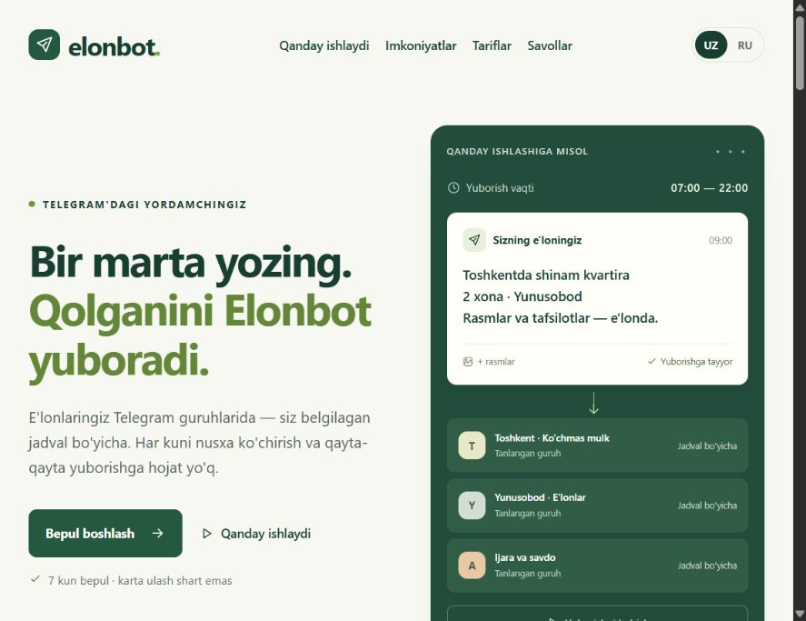
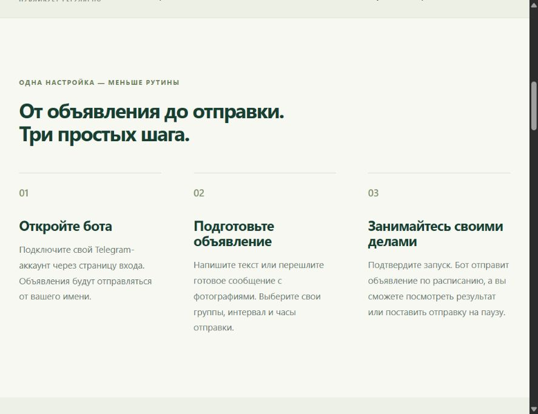
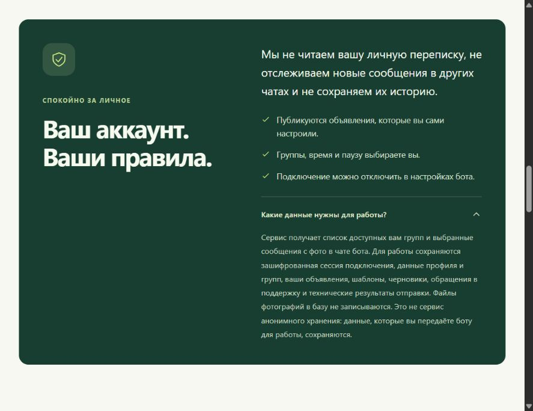
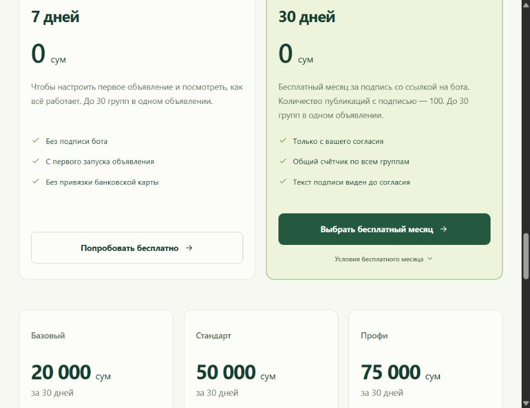
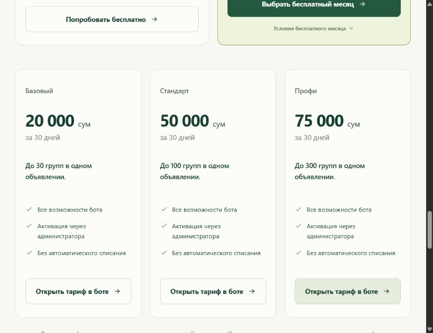
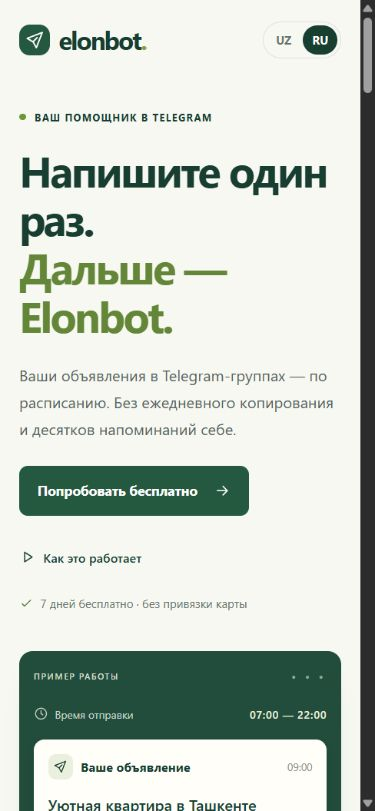
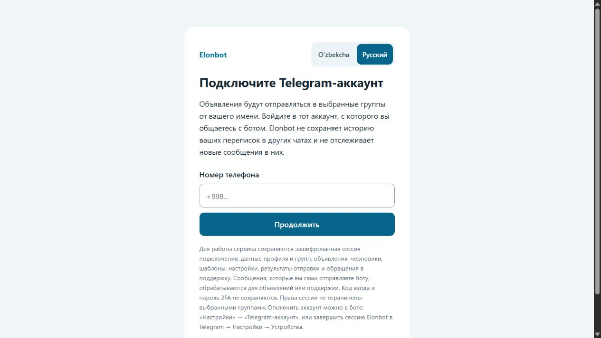

# Elonbot: обзор продукта, сайта и выхода на новые рынки

Дата: **28 сентября 2026 года**. Проверена текущая рабочая версия проекта, включая ещё не закоммиченные изменения тарифов и сайта. Это обзор кода и локального интерфейса, а не проверка работающего VPS или заключение о соответствии всем законам.

## Решение для владельца

**Сейчас не рекомендую покупать Telegram Ads или одновременно выходить на весь СНГ.** В продукте уже есть полезная техническая основа, но до привлечения новых пользователей нужно решить вопросы правил платформы, оплаты и первого успешного использования.

По вашим данным: зарегистрированы **25 человек, сейчас никто не пользуется**, объявления о сервисе размещаются в двух группах примерно по 2 000 участников. Это не 4 000 уникальных просмотров: аудитории могут пересекаться, реальные просмотры и переходы неизвестны. Отдельных данных о платежах и прежних успешных отправках нет. Стоимость сервера далее принята за **$10 в месяц** — трактовка вашего сообщения, а не проверенный счёт.

Отсутствие платной рекламы объясняет небольшой поток посетителей, но само по себе не объясняет неиспользование среди уже зарегистрированных. Возможны разные причины: люди не публикуют регулярно, не доверяют подключению аккаунта, не поняли настройку или столкнулись с ошибкой. Сейчас нельзя честно выбрать одну без разговоров и событий воронки.

Ближайшая цель: определить причину остановки у пяти существующих пользователей и, после решения вопроса платформы, получить три подтверждённых первых публикации и два повторных использования. Это выбранные критерии маленького пилота, не отраслевые нормативы и не статистическое доказательство спроса.

## Что проверено и что уже хорошо

Проверены основные пути: вход и языки, объявления и шаблоны, группы и фотографии, тарифы и акция, расписание и доставка, администрирование, поддержка, хранение данных, сайт и документы развёртывания. Просмотрены семь состояний интерфейса, включая мобильную ширину 390 px. Личный Telegram-аккаунт не подключался, реальные публикации и оплаты не выполнялись.

В проекте уже есть:

- Проверки владельца данных, подписанной авторизации Mini App, сроков действия ссылок входа, ограничения попыток и шифрование сессий подключения.
- Транзакции и блокировки, повторяемая обработка административных платежных действий, защита от устаревшей версии каталога. Цены и лимиты динамические, условия ранее выданного тарифа сохраняются отдельно от каталога.
- Очередь доставки с устойчивым идентификатором цикла, защитой от повторной успешной отправки, паузами при ограничениях Telegram и остановкой при PeerFlood.
- До десяти фотографий; новые фотографии представлены ID сообщений в чате с ботом, сохранена совместимость старых `file_id`.
- Прозрачные условия акции: согласие, общий счётчик успешных публикаций, продолжение подписи до выполнения обязательства даже после бесплатного месяца.
- Полный HTML на двух языках, серверные цены, canonical/hreflang, sitemap, robots и структурированные данные. Основной текст доступен без выполнения JavaScript.

Последний имеющийся полный прогон для этой версии приложения: **118 тестов прошли, check/build прошли**. В этом обзоре дополнительно выполнен изолированный сценарий [verify.ts](verify.ts) на PGlite и подставном Telegram: [результаты](verification.json). Это подтверждает конкретные сценарии кода, а не разрешение Telegram, качество реальной доставки или устойчивость VPS.

## Проблемы по приоритету

### P0. Схема подключения аккаунта конфликтует с правилами платформы

В [public/account.js](../../public/account.js) строки 20–26 и 89–97 реализован запрос кода Telegram и пароля 2FA. Бот направляет пользователя на эту страницу. В §5.2(d)(iv) [условий Bot Platform](https://telegram.org/tos/bot-developers) такой запрос запрещён. Это основание остановить масштабирование текущей схемы; наличие MTProto API само по себе не доказывает исключение для связанного с ботом сервиса.

Практическое направление — публикации от бота через Bot API в группах, куда его разрешили добавить и предоставили необходимые права. Это меняет продукт: потребуется участие администраторов групп. Если принципиальна отправка от личного аккаунта, сначала нужно подтвердить допустимую архитектуру. Перенос формы на другой домен или смена способа входа сами по себе не доказывают решение.

### P0 перед рекламой. Telegram Ads может не принять сам тип сервиса

В §5.11 [рекламных правил](https://ads.telegram.org/guidelines) ограничены средства нежелательных коммуникаций; среди примеров упомянуты инструменты автоматического размещения контента. Для текущего предложения это существенный риск отказа, а не утверждение, что конкретное объявление уже отклонено. Нельзя устранять этот риск маскировкой функций в рекламе. Также важна согласованность языка объявления и назначения.

Размещение у администратора тематической группы — отдельный канал привлечения. Оно не освобождает сам сервис от правил платформы и требований страны.

### P1 перед оплатами. Продажа цифровой услуги не доведена до подходящего платёжного сценария

Сейчас пользователь выбирает тариф в сумах и связывается с администратором; административная запись активирует доступ. В проекте нет полного пути Stars: счёта, проверки платежа, обработки успешного платежа и возврата.

Для цифровых услуг, продаваемых внутри Telegram, документация требует [Telegram Stars](https://core.telegram.org/bots/payments-stars). Наличие внешнего сайта не создаёт автоматического исключения. Нужно определить соответствующий правилам путь покупки, цену в Stars, фактическую сумму после вывода, поддержку платежей и возвратов. Цены в сумах могут оставаться ориентиром там, где это уместно, но сами по себе платёжную архитектуру не заменяют.

### P1. Смена тарифа пересчитывает права на весь остаток времени

В [app/admin.ts](../../app/admin.ts), строки 145–146, очередная оплата добавляет 30 дней к оставшемуся сроку, а лимит немедленно заменяется новым. В изолированной БД воспроизведено:

| Последовательность | Сумма | Результат сразу после оплат |
|---|---:|---|
| 3 периода «Базового» + 1 «Профи» | 135 000 сум | 120 оставшихся дней с лимитом 300 групп |
| 4 периода «Профи» для сравнения | 300 000 сум | 120 дней с лимитом 300 групп |
| Затем активация «Базового» | ещё 20 000 сум | Лимит сразу падает до 30, хотя оплаченный срок остаётся |

Это подтверждённое свойство правил начисления, а не доказательство злоупотребления пользователями. Оно создаёт потери выручки при повышении и спорные ожидания при понижении тарифа. Нужны отдельные периоды прав либо прозрачная доплата за повышение на оставшийся срок; понижение — со следующего периода. Уже оплаченные договорённости нельзя молча ухудшать.

### P1. Нельзя связать рекламу с реальной пользой и оплатой

Все девять ссылок сайта ведут на один адрес без `start`-параметра. В [app/bot.ts](../../app/bot.ts), строки 474–489, выбранное действие и источник не восстанавливаются; новой аудитории сначала показывается узбекский язык. Поэтому русская страница, кнопка конкретного тарифа и кнопка бесплатного месяца заканчиваются одинаковым входом.

Нужны [deep links](https://core.telegram.org/bots/features#deep-linking), передающие короткий идентификатор источника, язык и намерение. Русская кампания должна продолжаться на русском, сохраняя узбекский по умолчанию для обычного входа. Не менять сохранённый язык существующего пользователя без его решения.

Минимальная цепочка событий: источник → старт → выбор языка → готовность к работе → выбор разрешённой группы → создание → запуск → первая успешная публикация → повторная публикация в другой день → покупка. Достаточно технических идентификаторов и времени; текст переписки для такой аналитики не нужен.

### P1. Начало работы перегружено до первого результата

Изолированный тест нового пользователя с русским Telegram и параметром `ru_ad_test` получил первым узбекское приветствие. После выбора русского выполняются четыре текстовых действия API: изменение приветствия, меню, предложение подключения, условия акции. Последние занимают около 920 символов.

Дать один основной следующий шаг и показать небольшой готовый пример. Подробные условия сохранить доступными; предложение акции показывать там, где человек уже понимает пользу. Первая ценность — полученная и проверенная публикация в согласованной группе, а не регистрация или ввод телефона.

### P2. Пакеты слабо различаются, если считать все объявления

Лимит установлен **на одно объявление**, а активных объявлений по умолчанию десять ([app/config.ts](../../app/config.ts), строка 45). Значит, «Базовый» потенциально позволяет распределить объявления по 10 × 30 = 300 разным группам. «Профи» даёт удобство одной настройки на 300 групп, но не десятикратную скорость: очередь ограничивается на уровне аккаунта.

Это соответствует текущему обещанию, поэтому не следует называть такое использование обходом защиты. Нужно выяснить, за что готовы платить: одна настройка на много групп, несколько независимых кампаний, удобная отчётность, совместная работа. Менять упаковку только после проверки и с ясными условиями; не добавлять скрытый общий лимит.

### P2. Надёжность и себестоимость ещё не доказаны на масштабе

В [app/delivery.ts](../../app/delivery.ts), строки 31–32 и 95, объявления обрабатываются последовательным циклом, сетевые отправки выполняются внутри транзакции. Долгая загрузка одного аккаунта может задержать следующие. Персональные блокировки предотвращают часть конфликтов, но не устраняют эту общую очередь.

В [app/telegram.ts](../../app/telegram.ts), строки 326–330, фотографии загружаются для каждой целевой отправки. Условный пример: 10 изображений по 1 МБ × 300 групп ≈ 3 ГБ исходящего медиатрафика за проход. Это расчёт нагрузки при заданных допущениях, не измеренный расход сервера. Нужны измерения задержки очереди, трафика, ошибок и памяти, ограниченная параллельность между аккаунтами, сохранение последовательности внутри аккаунта и управляемые сетевые тайм-ауты.

**300 групп — ёмкость выбора, а не обещание одновременной отправки или отсутствия ограничений.** Локальный предел 20 публикаций в минуту не является выданной Telegram безопасной квотой. [Ошибки FloodWait](https://core.telegram.org/api/errors#420-flood) и [ограничения за нежелательные сообщения](https://telegram.org/faq_spam) действуют независимо. Техническое право писать в группу не равнозначно разрешению рекламировать.

### P2. Доверие и управление данными требуют завершения

Тексты подключения уже честно перечисляют сохраняемые данные и широкие права сессии. Формулировка «вообще ничего не храним» была бы неверной: сохраняются объявления, черновики, шаблоны, служебные сведения и обращения в поддержку.

В [docs/security.md](../security.md), строка 21, прямо указано отсутствие автоматического удаления всей учётной записи и единого срока хранения. Нужны данные оператора, понятная политика, сроки хранения по категориям и работающий процесс запроса удаления. Отключение аккаунта удалением всех данных не является. Шифрование сессий проверено в коде; шифрование дисков и резервных копий на VPS не проверялось.

## Сайт: семь проверенных состояний

Скриншоты сняты с текущего локального приложения. Это наблюдения интерфейса, а не результаты исследования пользователей. Телефон, код и пароль не вводились.

### 1. Первый экран на узбекском

**Сильное:** конкретное обещание экономии повторных действий, заметный переход в бот, наглядный пример. **Улучшить:** сфокусировать первый рекламный вариант на одной профессии и добавить честное подтверждение результата — короткую запись реального процесса с разрешёнными тестовыми группами. Макет публикации уже помечен как демонстрация; не выдавать его за клиентский кейс.

### 2. Объяснение работы на русском

**Сильное:** компактная последовательность и прямое указание отправки от имени пользователя. **Улучшить:** объяснить условия доступа к группам и показать реальный следующий экран. Три маркетинговых шага скрывают значительно больше действий настройки; измерить их длительность на пяти сессиях. После решения архитектуры обновить описание подключения.

### 3. Блок доверия и раскрытые данные

**Сильное:** есть раскрытие того, что действительно хранится. **Улучшить:** добавить доступные сведения об операторе, политику хранения и удаления, поддержку. Утверждение об отсутствии чтения чужой переписки описывает поведение приложения; оно не означает техническое ограничение MTProto-сессии только отправкой.

### 4. Бесплатные варианты

**Сильное:** 7 дней без подписи отделены от 30 дней за подпись; условия доступны. **Улучшить:** кнопка «Выбрать бесплатный месяц» должна открывать соответствующее предложение, а не общий старт. Подпись до 100 публикаций может выполниться за четыре прохода по 30 групп; это ещё не сто уникальных читателей и не сто клиентов.

Пробный период запускается при подтверждении объявления до фактического успеха отправки, акция — при согласии. Наблюдать, сколько людей расходуют срок без результата. Возможное изменение — запуск пробного отсчёта после первой успешной публикации с защитой от повторного получения; пока это гипотеза для следующей версии.

### 5. Платные тарифы

**Сильное:** цена за 30 дней и лимит на одно объявление видны рядом; нет обещания мгновенной отправки. **Улучшить:** сохранить выбранный тариф при переходе, показать подтверждённый платёжный сценарий и условия изменения пакета. Визуальная карточка не устраняет проблему начисления прав из раздела P1.

### 6. Мобильный первый экран

**Сильное:** заголовок читается, основной призыв виден без прокрутки, горизонтального переполнения при проверенной ширине нет. **Улучшить:** верхняя навигация скрывается без компактной замены; добавить доступ к тарифам и справке. Нижний служебный текст размером 10 px имеет измеренный контраст примерно **3,60:1**, ниже ориентира 4,5:1 для обычного текста по [WCAG](https://www.w3.org/WAI/WCAG22/Understanding/contrast-minimum.html). Это локальная проверка конкретной пары цветов, не полный аудит доступности.

### 7. Страница подключения

**Сильное:** выбор языка и описание данных присутствуют, поле имеет подпись. **Главная проблема:** сценарий требует чувствительного доверия ещё до пользы и связан с P0 выше. Простое увеличение кнопки не решит это. Просмотрен начальный экран с заведомо фиктивной локальной ссылкой; стадии кода и 2FA подтверждены исходным кодом, реальный вход не выполнялся.

### SEO и содержание

Техническая основа хорошая; переход на чистый HTML сам по себе не гарантирует высоких позиций. Нужны корректный публичный домен в canonical/sitemap, проверка индексации в Search Console, реальные мобильные показатели скорости и страницы под подтверждённые задачи клиентов. [Руководство Google](https://developers.google.com/search/docs/fundamentals/seo-starter-guide) поддерживает работу над доступностью и полезностью содержимого, но не обещает позиции за выбранный стек.

Начать с одного полезного материала для выбранной ниши и одного реального кейса с согласия клиента. Не создавать сотни одинаковых страниц по городам. Публичная индексация, поисковая частотность и Core Web Vitals в этом обзоре не измерялись; localhost-метаданные не являются доказательством ошибки production-домена.

## Возможности в СНГ и русскоязычных рынках

Общий язык и популярность мессенджера не превращают страны в один рынок. Важны повторяемость публикаций, разрешённые группы, доверие, оплата, часовой пояс и стоимость поддержки.

| Рынок | Рекомендация | Основание и пробелы |
|---|---|---|
| Узбекистан | Первый пилот: один город, одна ниша | Уже есть UZ/RU, сумы, время Ташкента и доступ к первым 25 пользователям. Самая дешёвая возможность проверить проблему. Спрос пока не подтверждён. |
| Казахстан | Следующий небольшой тест после пилота | Русская версия позволяет проверить конкретную русскоязычную аудиторию; нужны понятная оплата и локальное время. Это не заменяет казахскую локализацию для всего рынка. |
| Кыргызстан, Таджикистан | Сначала интервью и поиск партнёрских групп | Составить список площадок, где владельцы допускают регулярные объявления, проверить платёжную доступность. Данных о платящем спросе пока нет. |
| Россия | Не первый рынок при минимальном бюджете | Большая аудитория сочетается с отдельными вопросами доступа, оплаты и рекламного регулирования. До покупки размещения нужна актуальная проверка его допустимости и оформления. |
| Другие страны | Не запускать общий пакет «весь СНГ» | Нужны отдельные языковые, платёжные и правовые проверки. Обзор не доказывает привлекательность каждого рынка. |

Масштаб платформы подтверждают датированные исследования, но их нельзя превращать в прогноз ваших покупателей. [Mediascope](https://mediascope.net/upload/iblock/2ee/bdbcymunn4gcxjwcgjgjzsw74nrqtmz6/Mediascope_%D0%9D%D0%A0%D0%A4_Telegram.pdf) приводит для России 12+ за **октябрь 2024** месячный охват Telegram 72% и дневной 51%. Это не данные за сентябрь 2026.

В исследовании [British Council, Next Generation Kazakhstan](https://www.britishcouncil.org/sites/default/files/next_generation_kazakhstan_web_kaz.pdf), опубликованном в 2025 году, Telegram отмечен у 76% опрошенных молодых людей; опрос проводился в августе–октябре 2024 года, n=1 200, возраст 18–35. Это не доля всего населения и не сопоставимый с Mediascope показатель месячного охвата. [Internews](https://internews.org/resource/central-asian-media-consumption-and-disinformation/) также даёт контекст медиапотребления Центральной Азии, а не готовую оценку рынка автопубликаций.

Для России есть дополнительная оговорка по состоянию на дату обзора: [официальный канал Корпорации МСП](https://t.me/s/corpmspof?before=5853) в мартовском сообщении 2026 года передаёт позицию ФАС о переходном периоде по рекламе в Telegram/YouTube до конца 2026 года. Это не безусловное разрешение любой рекламы и не отмена остальных требований. Прямые страницы ФАС при проверке не загрузились. Перед российским размещением перепроверить текущую позицию регулятора, допустимость площадки и применимые требования маркировки/учёта с оператором рекламы или местным специалистом.

## Экономика при минимальном бюджете

Расчёт ниже — **только иллюстрация**. Принят условный курс **12 000 сум за $1**, он не проверялся как текущая рыночная котировка. Сервер $10 ≈ 120 000 сум в месяц.

| Тариф | Цена сейчас | Клиентов, чтобы покрыть только сервер |
|---|---:|---:|
| Базовый | 20 000 сум | 6 |
| Стандарт | 50 000 сум | 3 |
| Профи | 75 000 сум | 2 |

Это не точка прибыльности бизнеса: не учтены вывод и комиссии платежей, налоги, возвраты, поддержка, рекламные расходы и нагрузка бесплатных пользователей. Для расчёта брать фактический чистый доход после Stars/вывода, а не номинальную цену в сумах.

Формулы: **CAC = расходы на привлечение / новые платящие клиенты**; **покрытие сервера = округление вверх(сервер / месячный вклад клиента после переменных затрат)**. Регистрации не являются платящими клиентами.

Пример при тех же допущениях: $10 рекламы и два первых платящих клиента дают CAC $5. «Базовый» приносит около $1,67 в месяц до расходов; даже три месяца валовой выручки лишь сравняются с CAC. Удержание на три месяца пока не измерено, поэтому обещать окупаемость нельзя. Бесплатный месяц дополнительно откладывает платёж: его коммерческий результат следует смотреть после окончания 30 дней, а не через неделю.

Акция со 100 публикациями — затраты на распространение подписи в обмен на доступ, а не доказанный механизм роста. Нужны отдельная ссылка акции, число привлечённых активированных пользователей, жалобы и стоимость обслуживания. Условия и остаток подписи должны быть видны участнику, особенно после оплаты.

## План маленького теста

### Сейчас, без рекламных расходов

1. Разобрать P0 подключения и допустимый путь оплаты. До этого не приглашать новых людей вводить коды в текущую схему.
2. Попросить пять из существующих пользователей добровольно рассказать, на каком шаге они остановились. Сегментировать: есть ли регулярные собственные объявления и разрешённые группы. Сообщения пользователям в рамках этого обзора не отправлялись.
3. Выбрать один сегмент, например агенты по недвижимости одного города, уже вручную размещающие собственные объявления в 5–30 согласованных группах. Это проверяемая гипотеза. Обычный читатель группы объявлений может быть покупателем квартиры, но не покупателем вашего сервиса.
4. Зафиксировать источник и события до первой успешной отправки. Исправить смену тарифа и продолжение языка/действия из сайта.

Черновик личного вопроса для существующего пользователя: «Здравствуйте! Вы недавно открывали Elonbot. Хочу понять, что помешало попробовать: не было задачи, непонятна настройка, не захотели подключать аккаунт или возникла ошибка? Можно ответить одним сообщением. Ничего подключать сейчас не нужно». Это приглашение к обратной связи, не предложение рассылать его незнакомым людям.

### После устранения препятствий: 7–14 дней пилота

- Пять добровольных участников; один реальный сценарий и только разрешённые площадки. Время первой пользы измерять от начала настройки до проверенной успешной публикации.
- Рабочий ориентир продолжения: не менее трёх из пяти получили первый результат; двое вернулись и успешно опубликовали в другой день. Маленькая выборка даёт направление, не надёжную оценку конверсии.
- Если никто не начинает — исправить понятность/доверие или сегмент. Если запускают, но отправка не проходит — исправить доставку. Если первая отправка есть, а повторной потребности нет — пересмотреть задачу и аудиторию.
- Первую реальную готовность платить проверять после соответствующего бесплатного периода. При акции 30 дней потребуется более длинное наблюдение, ориентировочно до 35–45-го дня, а не заключение по двухнедельному тесту.

### Затем один платный эксперимент

Только после этих проверок можно выделить **$5–10 как предельную сумму одного теста**, если найдётся подходящее размещение по такой цене. Один согласованный пост у владельца тематического сообщества, одна страна, один сегмент, отдельная ссылка. Сначала запросить фактические просмотры и состав аудитории; количество подписчиков не заменяет просмотры. Цены размещений в этом обзоре не запрашивались.

Фиксировать расходы, уникальные старты, первые успешные публикации, повторное использование и платежи. Не распределять маленький бюджет одновременно между несколькими странами и креативами. Если получили старты без успешного использования — следующий расход направить на выяснение причины, а не увеличение трафика. Telegram Ads оставить отдельным будущим решением после проверки допустимости сервиса и формата.

## Что делать в разработке дальше

| Очерёдность | Работа | Критерий готовности |
|---|---|---|
| 1 | Допустимая архитектура публикаций | Есть подтверждённый сценарий без конфликта P0 и ясные требования к группам |
| 2 | Оплата и смена тарифов | Платёж подтверждается, повтор не удваивает доступ, повышение/понижение рассчитываются явно |
| 3 | Короткое начало работы + ссылки источников | RU остаётся RU, выбранное действие открывается, источник связан с первой публикацией |
| 4 | Доверие и данные | Политика, оператор, сроки, процесс удаления и поддержка доступны и соответствуют реализации |
| 5 | Устойчивость доставки | Измерены очередь и медианагрузка; медленный аккаунт не останавливает остальных |
| 6 | Подготовка следующей страны | Часовой пояс пользователя вместо фиксированного Asia/Tashkent, понятная оплата, локальные условия |

Увеличение числа функций, редизайн всего сайта и массовое SEO сейчас ниже по приоритету. Сайт уже достаточно понятен для качественного пилота после устранения платформенных проблем. Надо доказать повторную пользу конкретному клиенту.

## Метод и границы выводов

Применены модели **The Business Engineer · Gennaro Cuofano**: Constraint Mapping (BE-00-015), Activation Is the First Verified Outcome (BE-08-039), Time-to-Magic (BE-08-051), Retention Is the Ceiling (BE-09-004), Business Scaling Framework (BE-00-034). Практический вывод: сначала убрать ограничение платформы и получить подтверждённую пользу, затем оценивать повторение и экономику привлечения.

Проверена и альтернативная гипотеза: проблема может быть не в интерфейсе, а в том, что первые 25 человек не относятся к регулярным рекламодателям. Поэтому рекомендации по onboarding не выдаются за установленную причину отсутствия использования.

Факты из кода и локальных воспроизведений отделены от сведений владельца, внешних правил и предположений пилота. Не проверялись production-БД, платежные выписки, рекламный кабинет, настройки BotFather, доставка с реального аккаунта, фактическое шифрование VPS, конкурентные цены и поисковые позиции. Ни тесты, ни этот документ не являются сертификатом безопасности или обещанием одобрения рекламы.

Бизнес-логика и рабочий сайт в рамках обзора не изменены. Добавлены только материалы этого аудита.
